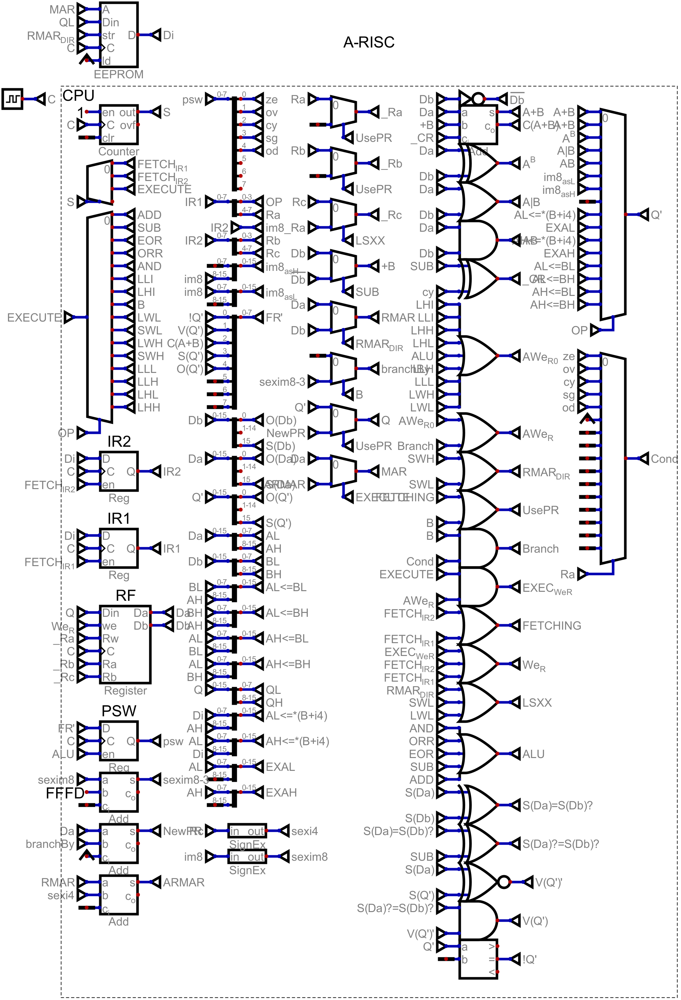

# A-RISC (Aderyn's RISC), Very simple 16 bit architecture
- notice registers 4-13 are optional

# Register File
| Index | MNemonic | Description | width (bits)
|---|---|---|---|
| 0 | `$pr` | Program Register (low bit is implicit) | 16 |
| 1..13 | `$rN` | Register | 16 |
| 14 | `$out` | Output Port | 16 |
| 15 | `$in` | Input Port | 16 |

# Flags
| MNemonic | Description |
|----------|-------------|
| `$ze`    | if result was zero |
| `$ov`| if result overflowed |
| `$cy`    | if the result was over 65535 |
| `$sg`| sign of the result |
| `$od` | was result odd |
| `$alw`| always |

# Opcode
| Code | MNemonic Prefix | Operation
|---|---|---|
| `0000` | `ADD` | `$rd <= $rs + $rs2 + $carry` |
| `0001` | `SUB` | `$rd <= $rs - $rs2 - $carry` |
| `0010` | `EOR` | `$rd <= $rs ^ $rs2` |
| `0011` | `ORR` | `$rd <= $rs \| $rs2` |
| `0100` | `AND` | `$rd <= $rs & $rs2` |
| `0101` | `LLI` | `$rd.low <= i8` |
| `0110` | `LHI` | `$rd.hig <= i8` |
| `0111` | `Bcc` | `$pr <= $pr + $i8` conditionally (1) |
| `1000` | `LWL` | `$rd.low <= *($rs + i4)` (2) |
| `1001` | `SWL` | `*($rd + i4) <= $rs.low` (2) |
| `1010` | `LWH` | `$rd.hig <= *($rs + i4)` (2) |
| `1011` | `SWH` | `*($rd + i4) <= $rs.hig` (2) |
| `1100` | `LLL` | `$rd.low <= $rs.low` |
| `1101` | `LLH` | `$rd.low <= $rs.hig` |
| `1110` | `LHL` | `$rd.hig <= $rs.low` |
| `1111` | `LHH` | `$rd.hig <= $rs.hig` |

## 1.
- use i4 in a multiplexer of the flags, if it is true, execute, otherwise, do not.
- all operatons change flags

## 2.
- this being an offset is optional

# opcode encoding
| bits | desc |
|------|------|
| `3:0` | opcode |
| `7:4` | $rd |
| `15:8` or `11:8` | `i8` or $rs |
| IF USING $rs `15:12` | IF NOT ALU `i4` ELSE `rs2` |

## note
- in B, we use $rd as the i4, so we can have i8 aswell

- fixed 16 bits

# Memory
- memory is 8 bits wide, with 65536 elements

# Notes
- the intended implementation is inside a Game, (scrapmechanic), therefore, the upper **6** bits of memory access is ignored for the main implementation, but, you CAN use the whole address for your impl
- lowest bit of pr can be ignored, so, remember to align your instructions
- branch immediates are sign extended
- i8,i4 in branch,memory access is sign extended
- the carry for ADD,SUB,XOR,ORR,AND is always the carry of the ADD/SUB node.

# Implementation
- the design is very simple, i am not sure if all of the ops even work (lol)

